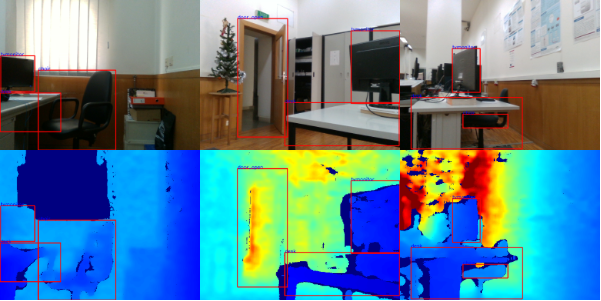

# ISR RGB-D Dataset
RGB-D Dataset recorded using the ISR-InterBot mobile platform

<p align="center"></p>

## Dataset
The non-object centric RGB-D dataset was recorded in the Institute of Systems and Robotics (University of Coimbra (ISR-UC)) facilities using the Intel RealSense D435 sensor onboard the ISR-InterBot mobile platform. The dataset contains 10,000 RGB-D raw images presenting a mission performed by the ISR-InterBot platform in a lab setting (image frames represent sequence), representing the object conditions under which robotic platforms may navigate. 
The dataset can be downloaded [here](https://universidadedecoimbra154-my.sharepoint.com/:u:/g/personal/uc2013153797_student_uc_pt/ET8G6AsJrqRDkEl1BudtyXgB8XQoBJUrC6HFFoREpZZQwA).

#### Labeling
Ten object categories (unknown, person, laptop, tvmonitor, chair, toilet, sink, desk, door-open, and door-closed) were labeled in every 4th frame achieving a total of 7,832 object-centric RGB-D images.
Each RGB-D pair raw image has its corresponding annotation file. Each row in the annotation file defines one bounding box, using the syntax `label_idx x_center y_center width height`. The coordinates are scaled into `[0, 1]`, and the `label_idx` should be zero-indexed and correspond to the row number of the class name.

#### Split
The path performed during the images acquisition was approximately split by half:

   - Training raw images ID `[0-4000; 7684-9000]`;
   - Testing raw images ID `[4004-7680; 9004-10000]`;
   - 4271/3561 object-centric RGB-D training/testing images.
   
You can perform the training/testing split by using the available code:

    $ python3 Still working on it


## Citation
If you use this dataset in your project or research, please consider citing it:

```
@INPROCEEDINGS{isr_rgbd_dataset,
  author={Pereira, Ricardo and Barros, Tiago and Garrote, Luís and Lopes, Ana and Nunes, Urbano J.},
  title={A Study of the Accuracy/Inference Speed Trade-Off in RGB-D Object Recognition for Mobile Robots Real-Time Applications},
  booktitle = {29th IEEE International Conference on Robot and Human Interactive Communication (RO-MAN)},
  year={2020}
}
```


## Contacts
If there are any issues, you can contact us:
ricardo.pereira@isr.uc.pt
